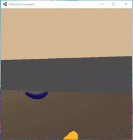

# bananabot
A bot for collecting yellow bananas in a unity environment

# DQN Agent running in environment

# Environment
This agent runs inside the Unity game engine using the unityagents python package to interact with the game and receive state and reward information. 
The agent is dropped into an environment on a flat plane that has randomly spawning yellow and purple bananas. Yellow bananas that are touched by the agent give the agent a reward of +1 and purple bananas that the agents touches give the agent a reward of -1. The goal of the player is to get the most reward. The player can move forward (w) back (s) turn left (a) and turn right (d). This game is episodic and is considered solve when the average score of our agent over 100 runs is above or equal to 13.

# Installation
In order to get a working environment for our agent first we will install Anaconda3 - [https://www.anaconda.com/products/individual]
Install python 3.6.x using anaconda3 prompt by typing in `conda create --name unity-agents python=3.6`
Install the Unity game engine [https://store.unity.com/download]
Install the Unityagents package within Unity [https://github.com/Unity-Technologies/ml-agents/blob/main/docs/Installation.md]
Install pytorch 1.7.1 inside out unity-agents anaconda environment `conda install pytorch=1.7.1`

# Training and Running our Agent
To train the agent, open the bananabot jupyter notebook. Make sure the jupyter server is pointing towards the unity-agents environment before starting. Run cells 1 through 4. If the agent training properly solves the environment; you can then watch the agent play the game by running cell 5.
