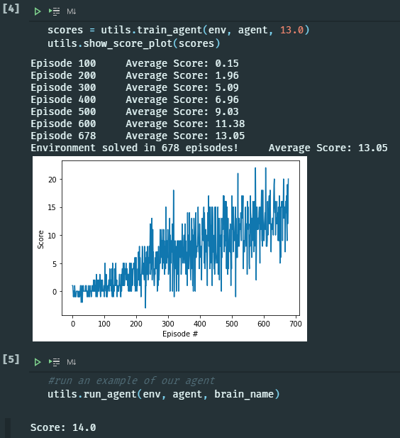

# Banana Agent Report 

In my implementation in the folder '/DQN' I provide a DQN utilizing recent experience replay. 
The other folders were intended for separate solutions but I got caught up with work priorities.

The DQN Algorithm uses a neural network to approximate the action value function of our Agent and Environment. Two neural networks are maintained a target network and local network. The target network is used to compute the difference between the current neural networks reward approximation and the previous learn steps predictions in order to provide accurate error values to the loss function.  After N steps (in our case 4) the target network is updated with the values from the current local network. Experiences provided the learn step include a random collection of samples from a ReplayBuffer in order to continue to learn from previous state-action-rewards observed before. 

The state of the system has been descritized into 45 segments, since the environment provides what I think are vectors towards bananas and a color state then breaking down the vector into values that divide evenly into 360 degrees seemed rational (I could have done something closer to descritizing for radians but oh well). I figured this would add enough granularity to assign reward properly without limiting the state too much that the agent could differentiate between two bananas somewhat close together.

The value of the state input into our Agent is an ordered array of 4 game states. The idea is to use this larger state space to prevent over valuing actions that avoid blue bananas that could have groups of yellow bananas behind them. Action size is simply the actions we can take in the current state, which is 0,1,2,3 representing moving up, down, turn left and turn right. The neural networks both have the same state and action sizes as well as the same hidden layer sizes. The hidden layer sizes were created as a the state size multiplied by the action size in order to represent, at least, the mapping of the state - action permutation , which I believed would be able to adequetly hold enough information to approximate the action value function without being prohibitevly large (my pc only has so much memory and other choices did crash the training segment due to OOM errors).

Below in the reward graph as well as the N episode reward averages. As well as the reward of a single run of the agent.

# Future improvements and current issues

Current issues with the Agent are moments of indecision. If the agent finds it self having to select between two seemingly equal yellow bananas that are sufficiently far away (outside the 4 game state width) it will wiggle back and forth in a moment of indecision and generally fail to get any reward. Another issues is if the Agent is surrounded by blue bananas, and a yellow banana is not within the 4 game state width, the Agent will again wiggle with indecision as there is seemingly no path to a positive reward.

While there are some common sense future improvements like implementing prioritized experience replay, DoubleDQN and DuelingDQN architectures I can't envision exactly how they'd overcome the issues outlined above. Widening the game state array could overcome these problems but this introduces more computation time both in training and running our agent. Perhaps implementing this (papers)[http://proceedings.mlr.press/v108/vieillard20a/vieillard20a.pdf] momentum based DQN would overcome the blue banana wall dillema and adding a small negative reward to time would overcome the equal positive reward dillema. I would need to test these to be sure but momentum would certain provide a solution to at least one of the problems. Moment may still increase the number of episodes it takes to train the agent but with an eventual higher average reward than our current DQN.